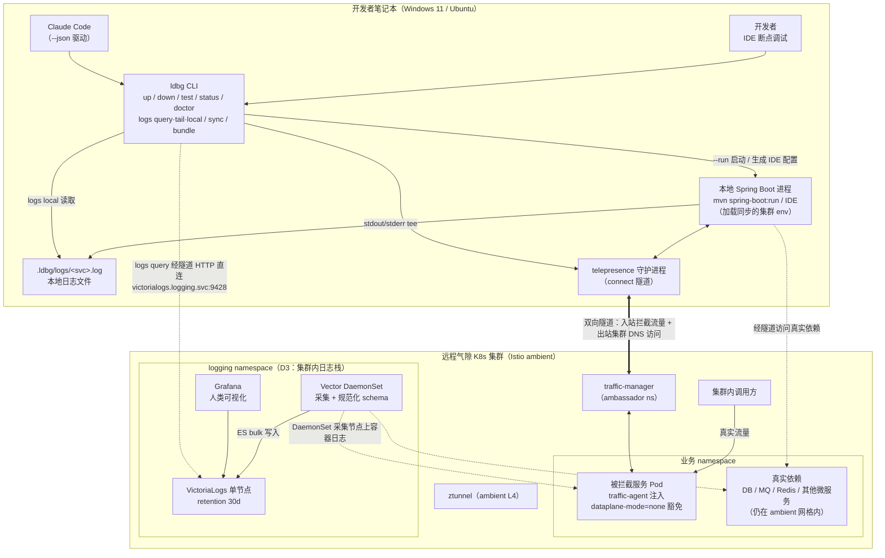
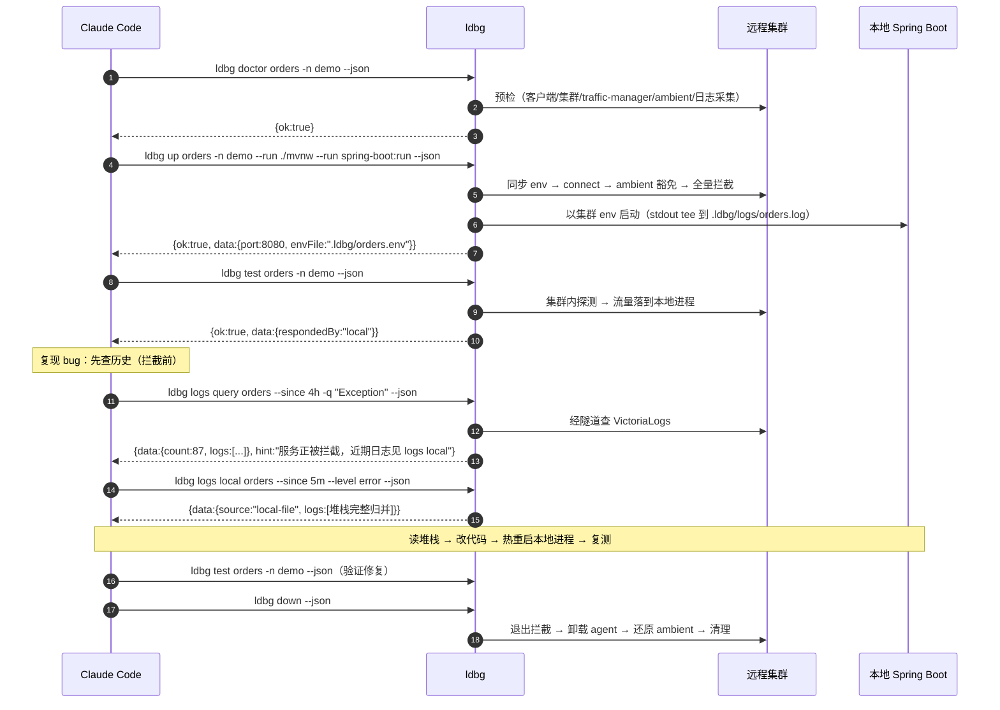
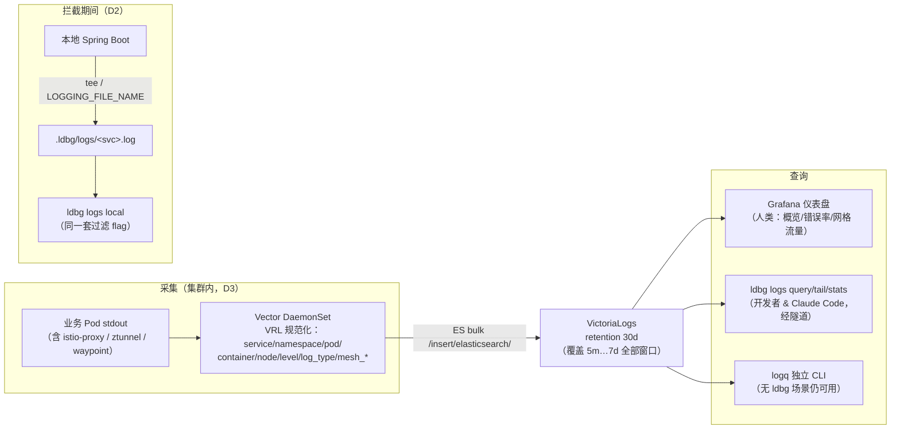
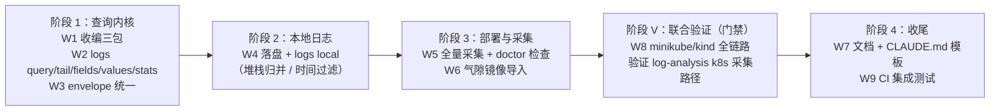

# 本地调试平台设计文档 —— `local-debug (ldbg)` × `log-analysis (logq)` 整合方案

> 版本：v1.1（2026-07-05，评审修订：结论经两轮代码级核查校准，新增 D5–D8 决策与 §13 验证记录）　状态：**已评审，验证进行中**
>
> 相关仓库：
> - [`github.com/hzeng10/local-debug`](https://github.com/hzeng10/local-debug) —— `ldbg`，基于 Telepresence 全量拦截的本地调试 CLI（已实现并在 minikube + Istio ambient 验证）
> - [`github.com/hzeng10/log-analysis`](https://github.com/hzeng10/log-analysis) —— 本地 k8s 日志分析系统（VictoriaLogs + Vector + Grafana + `logq` CLI，v0.1.1）

---

## 1. 背景与问题

开发者的微服务（以 Spring Boot / JDK 21 为主，约 100 个）运行在一个**远程共享、启用 Istio ambient 网格、气隙（无外网）**的 Kubernetes 集群中。传统调试循环缓慢且低效：

```
改代码 → 构建 jar → 拷进 Pod → 重启 → kubectl logs 逐个翻日志 → 猜测 → 再来一轮
```

我们希望达到的体验是：

- 开发者（或 Claude Code）在**本地笔记本**（Windows 11 / Ubuntu）上用 IDE 或 `mvn` 直接运行微服务；
- 该本地进程表现为集群中该服务的**真实实例**：接收真实流量、访问真实集群内依赖（DB / MQ / Redis / 其他微服务）；
- 服务日志可以按 **服务名/应用名、Pod、容器、关键字** 等维度查询，支持 **最近 5 分钟 / 30 分钟 / 1 小时 / 4 小时 / 8 小时 / 12 小时 / 24 小时 / 2 天 / 7 天** 等相对时间窗口；
- Claude Code 能以结构化（JSON）方式驱动整个「拦截 → 复现 → 查日志 → 改代码 → 验证」闭环。

## 2. 目标与非目标

### 目标

| # | 需求 | 说明 |
|---|------|------|
| G1 | 本地运行远程服务 | IDE 断点调试，或 `mvn spring-boot:run` / `./gradlew bootRun` / `java -jar`，由开发者或 Claude Code 启动 |
| G2 | 访问集群内依赖 | 本地进程用集群 DNS 名直连 DB/MQ/Redis/微服务，无需改配置 |
| G3 | 接管真实流量 | 集群内打到该服务的流量被路由到本地进程 |
| G4 | 日志多维查询 | 按 service/app、namespace、pod、container、关键字、日志级别查询 |
| G5 | 相对时间窗口 | 5m / 30m / 1h / 4h / 8h / 12h / 24h / 2d / 7d（保留期内任意窗口） |
| G6 | Claude Code 友好 | 全部能力有 `--json` 结构化输出与稳定 envelope，可编排闭环 |
| G7 | 气隙可部署 | 所有组件（Telepresence、日志栈）支持离线镜像导入安装 |

### 非目标（本期不做）

- 基于 header 的 *personal* 拦截（付费 + 需 License，气隙环境不可行）；
- Istio **sidecar** 模式支持（目标集群为 ambient；sidecar 列为未来工作，见 §10）；
- 同时在本地运行多个被拦截服务；非 JVM 服务；
- 分布式追踪（trace）系统建设（仅利用日志中已有的 `trace_id` 字段做关联查询）。

## 3. 现状评估：两个项目能否达成目标？

**结论：可以。两个项目高度互补，合计覆盖全部目标需求；缺口全部位于「接缝处」，工作量集中在 `ldbg` 侧的整合改造，不需要重写任何一方。**

### 3.1 `local-debug (ldbg)` 现状

Go CLI（cobra，14 个子命令，全部支持 `--json`），对 Telepresence 2.29.0 的薄封装：

- ✅ **G1**：`ldbg up --run <argv>` 是通用 exec（`cmd/up.go` 的 `launchApp`），`mvn`、`gradlew`、`java -jar` 均可直接启动；`--run-config intellij` 已能按 `pom.xml` 自动生成 **Maven `spring-boot:run`** 的 IntelliJ 运行配置（`internal/springconfig/runconfig.go` 的 `DetectBuildTool`）。缺口仅是**文档没有给 Maven 示例**。
- ✅ **G2/G3**：`telepresence connect` 隧道 + global/TCP 全量拦截，已在 minikube + Istio ambient 1.30 端到端验证；ambient 豁免（`istio.io/dataplane-mode=none`）已自动化。
- ✅ **G6（部分）**：统一 JSON envelope（`internal/output` 的 `{ok, command, data, error, hint}`）。
- ✅ **G7（部分）**：`ldbg bundle` / `ldbg cluster install`（离线导入 tel2 镜像 + 内嵌 chart 安装）。
- ❌ **G4/G5**：`ldbg logs` 只有 tail（`--follow/--tail/--container/--manager`）：
  - 无 `--pod` 过滤、无关键字过滤、**完全没有时间窗口**（全仓库未使用 `SinceSeconds`/`SinceTime`）；
  - 只能读**当前存活** Pod 的日志（Pod 重启/删除后历史丢失）；
  - 日志内容绕过 JSON envelope 直写 stdout，Claude Code 无法结构化消费。

### 3.2 `log-analysis (logq)` 现状

自托管的类 Splunk 日志系统（VictoriaLogs v1.51.0 存储 + Vector 0.56.0 采集 + Grafana 13 可视化 + `logq` Go CLI）：

- ✅ **G4**：统一 `Filter` 模型（`cli/internal/logsql/builder.go`）：`--service / -n / --pod / -c(容器) / --node / --level / -q(关键字，支持短语与大小写开关，含原生 LogsQL 逃生门)`，另有 `stats` 聚合、`fields`/`values` 字段自省。
- ✅ **G5**：`--since` 支持 `^\d+[smhdwy]$` 任意相对窗口（5m…7d 全部命中），月单位自动折算天；`--from/--to` 绝对区间；存储保留期 `-retentionPeriod=30d`，覆盖「最近 7 天」。
- ✅ **G6（部分）**：面向 AI agent 设计的稳定 envelope `{query, range, count, truncated, logs[]}`，`truncated` 提示 agent 收窄查询；输出 json/jsonl/raw/table。
- ✅ **G7（部分）**：组件镜像/二进制清单（`scripts/images.txt`、`binaries.txt`）+ 气隙部署文档。
- ✅ Istio 感知在**采集侧**：Vector VRL 区分 `mesh_mode=sidecar/ambient`、ztunnel（L4）、waypoint（L7）访问日志并解析 `method/path/status`。
- ⚠️ 局限：
  - `logq` 对 Kubernetes **零感知**（无 client-go），只会向 VictoriaLogs 发 HTTP —— 这恰好让它易于内嵌；
  - Go module 名为本地路径 `logq`（非 `github.com/...`），查询层在 `internal/` 下，**无法 `go get`，需拷贝/收编**；
  - **k8s DaemonSet 采集路径与 Istio 采集尚未在真实集群上验证**（其 design.md §12 自述），需要一次类似 ldbg Phase 0 的验证；
  - k8s 采集**按标签白名单**（`extra_label_selector = "logging.example.com/collect=true"` **硬编码**在 `deploy/k8s/vector-k8s.toml` 中；配置注释里提到的 `COLLECT_LABEL` 环境变量**并未接线**），未打标的服务查不到任何日志，且现状没有「全量采集」开关（见 D5）；
  - `logq` 的 VictoriaLogs HTTP 客户端**无任何认证**（无 token/basic-auth/TLS，见 D7）。

### 3.3 需求覆盖矩阵

| 需求 | ldbg | log-analysis | 合体后 | 缺口/工作项 |
|------|:----:|:----:|:----:|------|
| G1 本地运行（IDE / mvn） | ✅ | — | ✅ | 补 Maven 文档示例（W7） |
| G2 访问集群依赖 | ✅ | — | ✅ | 无 |
| G3 接管真实流量 | ✅ | — | ✅ | 无 |
| G4 多维日志查询 | ❌ | ✅ | ✅ | `ldbg logs query` 内嵌 logq 查询层（W1/W2） |
| G5 相对时间窗口 | ❌ | ✅ | ✅ | 随 W1 获得 |
| G6 Claude Code 闭环 | ✅ | ✅ | ✅ | envelope 统一（W3） |
| G7 气隙部署 | ✅ | ✅ | ✅ | 日志栈镜像并入离线包（W6） |
| 拦截期间本地日志可查 | ❌ | ❌ | ✅ | 本地文件源（W4，本设计新增） |
| 采集覆盖（打标/全量） | — | ⚠️ | ✅ | 采集策略 + doctor 检查（W5） |
| 真实集群验证 | ✅(ambient) | ❌(k8s 路径) | ⚠️ | 联合验证（W8） |

## 4. 关键设计决策（已与需求方确认）

| # | 决策点 | 结论 | 理由 |
|---|--------|------|------|
| D1 | CLI 形态 | **单一 CLI：把 `logq` 查询层内嵌进 `ldbg`**（`ldbg logs query ...`）。`log-analysis` 仓库继续独立存在（部署物 + 独立 `logq` 仍可用） | 开发者与 Claude Code 只面对一个入口、一套 flag、一套 envelope；logq 查询层为纯标准库（零依赖），拷贝成本极低 |
| D2 | 拦截期间本地应用日志 | **`ldbg` 直接读本地文件**（不回传集群） | 实现最简单；拦截期间集群侧（Grafana/logq 远程视角）对该服务存在空窗，**记为已知取舍**（缓解与未来选项见 §6.5） |
| D3 | 日志栈部署位置 | **远程集群内部署**（VictoriaLogs StatefulSet + Vector DaemonSet + Grafana），笔记本经 telepresence 隧道查询 | 日志属于集群基础设施，多开发者共享；隧道使笔记本无需任何额外端口暴露 |
| D4 | Istio 数据面模式 | **仅 ambient**（与 ldbg 已验证路径一致）；sidecar 列为未来工作 | 目标集群为 ambient；sidecar 拦截需独立验证，不阻塞本期 |
| D5 | 采集策略 | **在 log-analysis 新增「全量采集」开关**（kustomize overlay 移除 `extra_label_selector`，或将其接上真实的环境变量插值），调试集群以全量模式运行 | 现状白名单是硬编码且默认关闭，「忘打标 → 查无日志」是调试场景最伤体验的坑；代价是 log-analysis 一个小工作项 + 按 100 服务量级重估 PVC（W5/R4） |
| D6 | 拦截期间本地日志注入 | **默认注入** `LOGGING_FILE_NAME`（**绝对路径**，sync 时解析）并提供 `--no-local-log` 退出；`--run` 场景额外 tee stdout/stderr | IDE 与 `--run` 两种启动方式零配置可用 `logs local`；自定义 logback 忽略该属性的情形由 hint 兜底（§6.5） |
| D7 | 日志后端安全 | **接受集群内无认证 HTTP** 的 VictoriaLogs（气隙 + 内网，不对集群外暴露；可选 NetworkPolicy 收紧来源）；`--vlogs-auth` 仅列为未来扩展点 | 现状 logq 客户端无认证能力；在气隙内网集群中属可接受取舍，避免本期引入反代/认证链路 |
| D8 | 实施顺序 | 文档修订后、阶段 1 编码前，**先在 minikube 上做 R1/R2 验证 spike**（采集链路 + 隧道跨命名空间） | 两大风险都能在本机半天内变成事实，避免带着未验证假设动工 |

## 5. 总体架构



要点：

1. **入站**：集群内到目标 Service 的流量 → traffic-agent → 隧道 → 本地进程（全量接管）。
2. **出站**：本地进程经隧道以集群 DNS 名访问真实依赖；依赖看到的源 IP 是被拦截 Pod 的 IP（L4 鉴权可通过）。
3. **日志查询**：`ldbg logs query` 复用**同一条 telepresence 隧道**直连集群内 VictoriaLogs 的 Service 地址 —— **无需 port-forward、无需在集群边缘暴露任何端口**（详见 §6.4）。
4. **拦截空窗**：拦截期间本地进程的日志落在笔记本文件里，由 `ldbg logs local` 查询（D2，详见 §6.5）。

## 6. 详细设计

### 6.1 `ldbg logs` 子命令族（新命令面）

现有扁平的 `ldbg logs` 扩展为一个子命令族；**不带子命令时保持今天的 tail 行为**（向后兼容）：

```text
ldbg logs [service]                # 不变：tail 存活 Pod（--follow/--tail/--container/--manager）
ldbg logs query [service]          # 新：查询集群 VictoriaLogs（历史 + 多维过滤 + 时间窗口）
ldbg logs tail  [service]          # 新：VictoriaLogs 实时流（/select/logsql/tail），比 kubectl tail 多维度过滤
ldbg logs local [service]          # 新：查询拦截期间的本地日志文件（D2）
ldbg logs stats <expr>             # 新：聚合统计（LogsQL stats 管道），如按服务统计错误数
ldbg logs fields / values <field>  # 新：字段/取值自省（Claude Code 探索用）
```

`ldbg logs query` 的 flag 面（与 `logq` 对齐，去掉冗余）：

| flag | 说明 | 对应需求 |
|------|------|------|
| `[service]` 位置参数 / `--service` | 按服务名/应用名过滤（canonical schema 的 `service` 字段，取自 `app.kubernetes.io/name` → `app` → 容器名） | G4 |
| `-n, --namespace` | 命名空间（复用 ldbg 全局 flag 与 `resolveNamespace`） | G4 |
| `--pod` | 按 Pod 名过滤（含已删除/重启 Pod 的历史日志 —— 存储侧查询天然支持） | G4 |
| `-c, --container` | 按容器过滤（含 `istio-proxy`、ztunnel 等网格容器） | G4 |
| `--level` | 日志级别（大小写不敏感） | G4 |
| `-q <关键字>` | 关键字/短语（AND 组合；`-i` 忽略大小写；含 `:`/`\|` 时透传原生 LogsQL，支持 `trace_id:xxx`、`status:500` 等） | G4 |
| `--since` | 相对窗口：`5m / 30m / 1h / 4h / 8h / 12h / 24h / 2d / 7d` …（正则 `^\d+[smhdwy]$`，默认 `1h`，上限受 30d 保留期约束） | G5 |
| `--from / --to` | RFC3339 绝对区间，覆盖 `--since` | G5 |
| `--limit / --offset / --sort / --fields` | 分页 / 排序 / 字段投影（默认 `_time desc`，limit 1000） | G6 |
| `-o json\|jsonl\|raw\|table` | 输出格式（`--json` 全局 flag 等价于 `-o json` 并套 ldbg envelope） | G6 |

**默认值智能化**：若当前存在活跃拦截，`service` 缺省即为被拦截服务 —— Claude Code 调试时直接 `ldbg logs query --since 30m -q Exception` 即可。实现依据：`telepresence status --format json` 的 `user_daemon.intercepts[].{name,namespace}`（ldbg 的 `internal/tp` 已解析该结构）；这是**实时查询**，ldbg 不持久化任何拦截状态文件。

**保留字说明**：`query/tail/local/stats/fields/values` 作为 `logs` 的子命令后，会遮蔽同名服务在 `ldbg logs <svc>` 位置参数上的写法（cobra 子命令优先于位置参数）。若真有服务叫这些名字，用 `ldbg logs query --service query` 形式绕开；实践风险很低，文档标注即可。

### 6.2 查询层内嵌方式（D1 落地）

`logq` 的三个内部包为**纯 Go 标准库、零第三方依赖**，采用**拷贝收编**（vendor by copy）：

```text
log-analysis/cli/internal/logsql/  →  local-debug/internal/logquery/logsql/   （Filter→LogsQL 构建器 + NormalizeSince 时间窗口解析）
log-analysis/cli/internal/client/  →  local-debug/internal/logquery/client/   （VictoriaLogs HTTP 客户端：Query/Tail/Stats/FieldNames/FieldValues）
log-analysis/cli/internal/output/  →  local-debug/internal/logquery/format/   （envelope 与 json/jsonl/raw/table 渲染，适配 §6.3）
```

- 已核查（v0.1.1）：三包合计 **497 行**（`builder.go` 189 / `client.go` 170 / `output.go` 138，另有 `builder_test.go` 107 行一并拷入），**全部仅依赖 Go 标准库**（无 go.sum）；包间唯一依赖是 `output → logsql`（仅用其 `Range` 类型），`client` 完全独立；
- 拷贝时需把内部 import 路径 `logq/internal/logsql` 改写为 `github.com/hzeng10/local-debug/internal/logquery/logsql`（Go 的 `internal/` 可见性对同 module 内的 `cmd/` 无碍）；
- 每个文件头加注来源注释（`// vendored from github.com/hzeng10/log-analysis cli/internal/... @v0.1.1`），并在两仓库 README 声明「查询层以 log-analysis 为上游，改动先回流上游再同步」；
- 不引第三方依赖的约束保持不变（ldbg 现依赖仅 cobra + client-go）；`output` 包的四个渲染函数均写入调用方给定的 `io.Writer`，天然适合内嵌；
- `logq` 独立 CLI 继续存在，供未装 ldbg 的用户/CI 使用；
- **为什么不抽共享 module**：气隙环境无法 `go get` 私有 proxy，路径耦合两仓库发布节奏；不足 500 行的拷贝同步成本低于模块治理成本。

### 6.3 JSON envelope 统一（G6）

`ldbg` 既有 envelope 为 `{ok, command, data, error, hint}`，`logq` 为 `{query, range, count, truncated, logs[]}`。统一规则：**外层用 ldbg envelope，logq envelope 整体作为 `data`**：

```json
{
  "ok": true,
  "command": "logs query",
  "data": {
    "query": "service:=\"orders\" AND _msg:i(Exception) AND _time:4h",
    "range": {"since": "4h"},
    "count": 87,
    "truncated": false,
    "logs": [ {"_time": "...", "service": "orders", "pod": "...", "container": "...", "level": "ERROR", "_msg": "..."} ]
  },
  "hint": ""
}
```

- `data.query` 回显实际执行的 LogsQL —— Claude Code 可自检查询是否符合意图；
- `truncated=true` 时在 `hint` 中提示「收窄时间窗或加过滤条件」，与 agent 工作流（fields → query → 收窄）呼应；
- 人类模式（无 `--json`）默认 `-o table`（time / level / service / pod / message）。

### 6.4 VictoriaLogs 地址解析（隧道直连）

`ldbg` 按以下优先级解析日志后端地址：

1. `--vlogs-addr` flag / `VLOGS_ADDR` 环境变量（显式覆盖）；
2. **telepresence 已连接** → 集群 DNS 直连 `http://victorialogs.logging.svc.cluster.local:9428`（隧道让笔记本可解析集群 DNS，零额外配置 —— 这是与 telepresence 集成带来的免费能力）；
3. 未连接 → 用 client-go 原生 `port-forward svc/victorialogs 9428` 作为回退，用后即焚。**实现前提**：`internal/k8s/client.go` 目前构建 clientset 后**丢弃了 `rest.Config`**，而 port-forward（SPDY）必须持有它 —— 需把 `restCfg` 保留到 `Client` 结构体上（小的增量改动，已计入 W2；fake-client 测试路径无 rest.Config，该路径不支持 port-forward 属预期）；
4. 都不可用 → 报错并 `hint` 提示先 `telepresence connect` 或部署日志栈（`ldbg doctor` 同步给出检查项）。

`logging` namespace 与 Service 名可经 `--vlogs-namespace` 配置，默认约定 `logging/victorialogs`（已核对 log-analysis 清单：Service `victorialogs`、namespace `logging`、端口 `9428`、`-retentionPeriod=30d`、PVC 20Gi）。

**跨命名空间可达性依据**（针对「连接被 scope 到业务 namespace，能否访问 `logging` 里的服务」的疑问）：Telepresence v2.29.0 中 `connect --namespace` 只是 CLI 请求的解析范围；出站 DNS/NAT 由 `--mapped-namespaces` 管辖，其**默认值是全部 namespace**，而 `ldbg up` 从不收窄它 —— 因此隧道直连跨命名空间的 VictoriaLogs 与官方语义一致。此结论已按帮助文档核实，运行时证据由 §13 验证记录补充（若实测失败，回退路径 3 升级为主路径）。

### 6.5 拦截期间的本地日志（D2 落地）

**问题**：拦截期间流量到了笔记本，Pod 里的原实例不再产生业务日志，本地进程日志不进集群存储 —— 集群侧查询对该服务出现空窗。

**方案（D2：直接读本地文件）**：

1. **日志落盘**（D6：默认开启，`--no-local-log` 退出）：
   - `ldbg up --run ...` 启动的进程：stdout/stderr 经 `io.MultiWriter` **tee** 到 `.ldbg/logs/<service>.log`（终端仍实时可见）。现 `launchApp` 直接继承 stdio、仓库内无现成 tee 工具，此为新增代码；文件名中的服务名沿用 `runconfig.go` 的 `sanitize()` 规则（Windows 文件名不允许 `:` 等字符）。
   - IDE 启动的进程：`ldbg sync`/`up` 在 env-file 中额外注入 `LOGGING_FILE_NAME=<sync 时解析的绝对路径>/.ldbg/logs/<service>.log`（Spring Boot 原生属性 `logging.file.name` 的 relaxed-binding 形态），应用即同时写控制台与该文件，**零代码改动**。注入**绝对路径**是刻意的：相对路径依赖 IDE 的工作目录，跨机器/跨 IDE 不可靠（Java 在 Windows 上接受 `/` 分隔符，无需转换）。
   - 注意两点：这是 ldbg **首个「合成」环境变量**（现有 env-file 只含集群真实变量），文件头注释中会标注其来源；应用若自带完全自定义的 `logback(-spring).xml`（未 include Spring 默认配置），`logging.file.name` 可能被忽略 —— `logs local` 查不到文件时在 `hint` 中指明该原因与两种补救（`--run` 模式 tee 不受影响；或把 IDE 控制台日志手动指到该路径）。
   - `ldbg down` 清理：现 `cleanupGeneratedDir()` 是**浅遍历**（`os.Remove` 逐项删除，遇到 `.ldbg/logs/` 子目录会静默失败）—— W4 须将其改为递归删除，`--keep-files` 语义不变。
2. **本地查询**：`ldbg logs local [service]` 支持与 `logs query` 同名的 `-q / -i / --level / --since / --from / --to / --tail` 子集：
   - 时间过滤：按行首时间戳解析（默认识别 Spring Boot 缺省格式 `yyyy-MM-dd HH:mm:ss.SSS`，可用 `--ts-format` 覆盖）；该格式**不带时区**，按笔记本本地时区解释（与 `--since` 相对窗口自洽）；解析失败时降级为不做时间过滤并在 `hint` 声明（见 R5）；
   - 无时间戳的行（异常堆栈续行）**归并到上一条日志**，保证堆栈完整返回；
   - 输出复用 §6.3 envelope（`data.source="local-file"` 标识来源）。
3. **空窗标注**：`ldbg logs query` 检测到目标服务当前正被拦截时，在 `hint` 中加注「该服务正被拦截，`<since 时间>` 内的本地日志请用 `ldbg logs local`」—— 引导 Claude Code 拼合两个来源。
4. **未来可选项**（不在本期）：用 log-analysis 现成的 standalone Vector（file source）把本地日志经隧道回写集群 VictoriaLogs，实现远程视角无缝 —— 采集配置已存在，只差发布一条 runbook。

### 6.6 采集侧策略（G4 的前提）

日志能被查到的前提是 Vector 采集到位。针对约 100 个服务的共享调试集群：

- **现状核查（重要更正）**：白名单选择器是**硬编码**在 `deploy/k8s/vector-k8s.toml` 里的（`extra_label_selector = "logging.example.com/collect=true"`）；配置注释提到的 `COLLECT_LABEL` 环境变量**并未接线**，DaemonSet 也没有设它 —— 即今天**不存在**任何「全量采集」开关，opt-in 还是 log-analysis 有意的设计取舍（其 design.md 自述「高效、默认关闭」）。
- **决策（D5）：在 log-analysis 新增全量采集开关**，作为其一个明确工作项（W5）：推荐实现为 kustomize overlay `deploy/k8s/overlays/collect-all/`（patch 掉 `extra_label_selector`），或将选择器接上真实的环境变量插值。调试集群以全量模式部署 —— 调试场景无法预知会查哪个服务，白名单模式的「忘打标 → 查无日志」是最伤体验的坑。全量后须按实测日志速率重估 PVC（默认 20Gi 起步，30d 保留期，见 R4）。
- **collect-all 必须排除基础设施 namespace**（V2 实测确认，§13）：无选择器时 Vector 会扫遍所有 namespace，`kube-system`/`istio-system` 组件的日志量轻松淹没业务日志（istio-cni 半小时上千条），且采集 `logging` namespace 自身会形成 Vector 自采集回环。overlay 应通过 namespace 排除（VRL filter 按 `namespace` 丢弃，或 `extra_namespace_label_selector`）默认排除 `kube-system`、`kube-node-lease`、`istio-system`、`logging`；网格排障需要 ztunnel/waypoint 日志时走既有的 `COLLECT_MESH_INFRA` 专用通道而非全量兜底。
- 若个别环境仍用白名单：部署清单中为业务服务**预置** `logging.example.com/collect=true`（打在 Deployment 的 pod template 上；注意 kubelet 端过滤，改标签会触发滚动重启，所以要在部署期做而非调试期做，且新打标服务没有历史日志）。
- `ldbg doctor <svc>` 新增检查项：目标服务近 N 分钟在 VictoriaLogs 中是否有日志流入；无则提示采集未覆盖及修复方法（该检查以 `warn` 而非 `fail` 呈现，避免日志栈缺席时 doctor 整体判负）。
- 网格基础设施日志（ztunnel L4 / waypoint L7 访问日志）按需开启（`COLLECT_MESH_INFRA=true`，这个环境变量**是**真实接线的——由 VRL filter 在 transform 阶段闸控），用于「流量确实到了/没到」的排障。

### 6.7 运行方式与 Maven（G1 补全）

- `--run` 本就是通用 exec，本期只补**文档与示例**（README、SETUP、RUNBOOK 全部补 Maven 路径）：
  ```bash
  ldbg up orders -n demo --run ./mvnw --run spring-boot:run          # Maven Wrapper
  ldbg up orders -n demo --run mvn --run -q --run spring-boot:run    # 系统 mvn
  ```
- IntelliJ 运行配置生成已支持 Maven（`DetectBuildTool` 按 `pom.xml` 自动选 `spring-boot:run`）；`up` 的人类提示文案补上 Maven 分支；
- VS Code `launch.json` 生成保持通用 Java launch（原生 `envFile`），文档注明 Maven 项目建议配合 IntelliJ 配置或 `--run`。

### 6.8 Claude Code 调试闭环（G6）



配套建议：在业务服务仓库放一段 `CLAUDE.md` 模板（本设计交付物之一），教会 Claude Code 上述命令序列与 envelope 语义，实现「开发者打断点、Claude Code 跑闭环」的协作分工。

## 7. 日志链路全景



时间窗口对照（G5，全部由 `--since` 一个 flag 覆盖）：

| 需求窗口 | 5 分钟 | 30 分钟 | 1 小时 | 4 小时 | 8 小时 | 12 小时 | 24 小时 | 2 天 | 7 天 |
|---|---|---|---|---|---|---|---|---|---|
| `--since` 取值 | `5m` | `30m` | `1h` | `4h` | `8h` | `12h` | `24h`（=`1d`） | `2d` | `7d`（=`1w`） |

## 8. 工作项清单

| # | 工作项 | 仓库 | 规模 | 依赖 |
|---|--------|------|------|------|
| W1 | 拷贝收编 `logsql`/`client`/`format` 三包（含来源注释与回流约定） | local-debug | 小 | — |
| W2 | 新增 `logs query / tail / local / stats / fields / values` 子命令 + 地址解析（§6.1/6.4）；含把 `rest.Config` 保留到 `internal/k8s.Client` 以支持 port-forward 回退 | local-debug | 中 | W1 |
| W3 | envelope 统一 + `hint` 空窗标注 + 拦截态默认 service（§6.3/6.5.3） | local-debug | 小 | W2 |
| W4 | 本地日志落盘（`--run` tee[`io.MultiWriter` 新增] + env 注入**绝对路径** `LOGGING_FILE_NAME` + `--no-local-log`）、`logs local` 时间戳/堆栈归并/本地时区、文件名 `sanitize()`、`down` 清理改**递归**（§6.5） | local-debug | 中 | — |
| W5 | **新增全量采集开关**（kustomize overlay `overlays/collect-all/` 或真实接线选择器环境变量，D5），**须内置基础设施 namespace 排除清单**（V2 实测要求，§6.6/§13）+ `doctor` 日志流入检查（warn 级，§6.6） | log-analysis + local-debug | 小 | 日志栈部署 |
| W6 | 气隙安装打通：复用 log-analysis 现成的 `scripts/save-images.sh`/`load-images.sh`/`mirror-to-registry.sh` + `images.txt` 编入 runbook；**Grafana 定制镜像须在联网机器上构建**（插件在 build 时下载），产物镜像随包离线分发 | log-analysis | 中 | — |
| W7 | 文档：Maven 示例、`CLAUDE.md` 模板、logs 命令族文档（中英对照的中文版） | local-debug | 小 | W2 |
| W8 | **联合验证**（§9 阶段 V）：minikube/kind 上 ambient + 拦截 + 日志栈全链路，补 log-analysis 未验证的 k8s 采集路径 | 两仓库 | 中 | W1–W5 |
| W9 | 集成测试扩展：现有 kind harness 增加日志栈部署与 `logs query` 断言 | local-debug | 中 | W8 |

## 9. 实施路线图



- 阶段 1 完成后即可对**未拦截**服务提供完整 G4/G5 查询能力（价值最早落地）；
- 阶段 V 是发布门禁：log-analysis 的 k8s DaemonSet 采集 + Istio ambient 日志分类首次上真实集群验证，通过后才写「已验证」；
- 真实目标环境（Windows 11 笔记本 → 远程气隙集群）验证沿用现有 `docs/RUNBOOK.windows-remote.zh-CN.md`，追加日志栈章节。

## 10. 风险与待验证项

| # | 风险/未知 | 影响 | 缓解 |
|---|-----------|------|------|
| R1 | ~~log-analysis 的 k8s DaemonSet / Istio 采集从未在真实集群跑过~~ **已消除**：V1/V2 在 minikube 实测通过（§13） | ~~查询空结果、schema 字段缺失~~ | 阶段 V 门禁做全链路复验；`doctor` 日志流入检查兜底 |
| R2 | ~~经隧道跨命名空间访问 VictoriaLogs 未经运行时实测~~ **已消除**：V3 实测通过（§13）——`connect -n demo` 时 `logging` 在默认映射内，query/stats 均经隧道成功 | ~~`logs query` 不通~~ | port-forward 保持为回退路径（§6.4 第 3 级）；目标真实集群上仍复验一次（网络策略可能不同） |
| R3 | 拦截期间集群侧日志空窗（D2 取舍） | 远程协作者/Grafana 视角缺失该服务近期日志 | `hint` 标注 + `logs local`；未来 standalone Vector 回传（§6.5.4） |
| R4 | 全量采集（D5）的存储压力（100 服务 × 30d） | PVC 写满 | 部署时按实测日志速率核算 PVC（默认 20Gi 大概率不够，需实测后调整）；VictoriaLogs 支持按流限额与降保留期 |
| R8 | VictoriaLogs 无认证 HTTP（D7 已接受的取舍） | 集群内任意工作负载可读日志 | 气隙内网 + 不对集群外暴露；可选 NetworkPolicy 限制来源；`--vlogs-auth` 留作未来扩展点（§11） |
| R5 | 本地日志时间戳格式非 Spring Boot 缺省 | `logs local --since` 失效 | `--ts-format` 覆盖；解析失败时降级为不做时间过滤并在 `hint` 声明 |
| R6 | sidecar 模式集群（未来） | 拦截方案需重设计（envoy 端口冲突处理不同） | 明确列为非目标；未来单独 spike |
| R7 | 两仓库查询层代码漂移 | 行为不一致 | 来源注释 + 「上游先行」回流约定（§6.2）；W9 CI 断言关键行为 |

## 11. 附加建议（超出原始需求，供采纳）

1. **`CLAUDE.md` 模板**（W7）：给每个 Spring Boot 服务仓库一段标准说明，声明 `ldbg` 闭环命令序列、envelope 字段语义、时间窗口写法 —— 让任意会话中的 Claude Code 即插即用。
2. **`trace_id` 关联查询**：canonical schema 已含 `trace_id`，`-q "trace_id:xxx"`（原生 LogsQL 逃生门）即可跨服务串起一次调用链，文档给出示例；无需引入 APM。
3. **`ldbg logs stats` 用于「验证修复」**：修复后 `ldbg logs stats "by (level) count() as c" --service orders --since 10m` 对比错误计数归零，是 Claude Code 可机读的验收信号。
4. **Grafana 面向人类保留**：ldbg/logq 服务于 CLI/agent；4 块现成仪表盘（概览/错误/网格流量）继续作为团队共享视图，两者查同一份数据，无重复建设。
5. **未来（不在本期）**：MCP server 封装 `logs query`（当前 CLI+JSON 已满足 Claude Code）；standalone Vector 本地日志回传（§6.5.4）；sidecar 模式支持；`--vlogs-auth`（basic-auth/token）以支持加认证的日志后端（D7 当前接受无认证）。

## 12. 附录：整合后命令速查

```bash
# ―― 调试闭环 ――
ldbg doctor orders -n demo                 # 预检（含日志采集覆盖检查）
ldbg up orders -n demo --run ./mvnw --run spring-boot:run   # 接管 + 本地启动（Maven）
ldbg test orders -n demo                   # 集群内探测：流量确已到本地
ldbg down                                  # 退出拦截并还原一切

# ―― 日志查询（新增，全部支持 --json）――
ldbg logs query orders --since 4h -q "Exception"            # 关键字 + 时间窗
ldbg logs query --pod orders-7f9c-x2k4 --since 30m          # 按 Pod（含已删除 Pod 历史）
ldbg logs query orders -c istio-proxy --level error --since 12h   # 按容器 + 级别
ldbg logs query orders -q "trace_id:4bf92f35" --since 2d    # 按 trace 关联
ldbg logs tail orders -q error                              # 实时流（存储侧过滤）
ldbg logs local orders --since 5m --level error             # 拦截期间的本地日志
ldbg logs stats "by (service) count() as c" --since 1d      # 聚合统计
ldbg logs fields && ldbg logs values service                # 字段自省（agent 探索）
```

## 13. 验证记录（D8 spike）

> 目的：动工前把两大风险（R1 集群内采集链路、R2 隧道跨命名空间访问）在本机 minikube 上变成事实。
> 环境：Ubuntu 笔记本，minikube + Istio ambient 1.30 + Telepresence OSS 2.29.0 + log-analysis v0.1.1。

| 编号 | 验证项 | 方法 | 结果 |
|------|--------|------|------|
| V1（R1） | Vector DaemonSet 在 k8s 上真实采集（打标 opt-in 路径），canonical schema 字段齐全 | 部署 `deploy/k8s/`（Grafana 缩容为 0，镜像未本地构建）→ 给 `orders` 打 `logging.example.com/collect=true`（触发滚动重启）→ `logq --service orders --since 30m` | ✅ **通过**。返回该 Pod 启动日志，schema 字段齐全且正确：`service=orders`（由 `app` 标签推导）、`namespace=demo`、`pod`、`container`、`node`、`log_type=app`、`_time` |
| V2（R1/D5） | 移除 `extra_label_selector` 后未打标 Pod 也被采集（collect-all 开关的形态依据） | 生成去掉 app_logs 选择器的配置 → 新 ConfigMap + patch DaemonSet 卷 → 滚动 Vector → 重启未打标的 `dep` → `logq --service dep --since 5m` | ✅ **通过**，未打标服务被采集。**重要发现**：无选择器时会扫遍**所有** namespace（`istio-cni` 1105 条、`istiod` 833 条、`storage-provisioner` 30 分钟 793 条……）——collect-all overlay **必须排除基础设施 namespace**（`kube-system`/`istio-system`/`logging` 自身，后者防 Vector 自采集回环），已计入 W5 |
| V3（R2） | `connect -n demo` 后跨命名空间直连 `victorialogs.logging.svc.cluster.local:9428` | 用户手动 `telepresence connect -n demo`（root daemon 需 sudo）→ 杀掉 port-forward 排除干扰 → 笔记本 `curl .../select/logsql/query` + `VLOGS_ADDR=<FQDN> logq`（query 与 stats 两个端点） | ✅ **通过**。`telepresence status` 实证 `Mapped namespaces: [ambassador default demo istio-system kube-public logging]` —— 连接虽 scope 到 `demo`，`logging` 仍被映射（与 §6.4 的帮助文档论证一致）；无 port-forward 状态下 query/stats 均经隧道返回数据 |

**结论与对设计的影响**：R1、R2 两大风险均已消除，log-analysis 的 k8s 采集路径获得首次真实集群验证，§6.4 隧道直连方案成立（port-forward 保持为回退而非主路径）。设计新增一条硬性要求：**W5 的 collect-all overlay 必须带 namespace 排除清单**（否则基础设施日志淹没业务日志且浪费存储）。遗留环境说明：spike 结束后 minikube 上保留了日志栈（Vector 处于 collect-all 试验配置、Grafana 副本 0、`orders` 带 collect 标签），供阶段 1 开发迭代直接复用；恢复 opt-in 只需把 DaemonSet 的卷指回原 ConfigMap。
